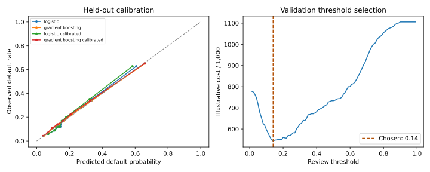

# Credit risk modeling

Predict next-month credit-card default, then check whether the probabilities and
review policy are useful. This project compares a logistic baseline with gradient
boosting, evaluates post-hoc calibration, and exposes the selected model through
a local API and analyst demo.

The main result: gradient boosting improves test ROC-AUC from **0.759 to 0.782**
and average precision from **0.505 to 0.551**. Sigmoid calibration slightly
worsened validation Brier score, so the served model keeps its original
probabilities. The report includes that result rather than assuming calibration
must help.



## Results

30,000 records from the UCI Default of Credit Card Clients dataset; 5,982 held-out
test records. Identical predictor profiles stay in the same split.

| Model | Test ROC-AUC | Test average precision | Test Brier ↓ |
|---|---:|---:|---:|
| logistic | 0.7587 | 0.5048 | 0.1398 |
| gradient boosting | 0.7817 | 0.5512 | 0.1333 |
| logistic calibrated | 0.7587 | 0.5048 | 0.1400 |
| gradient boosting calibrated | 0.7817 | 0.5512 | 0.1333 |

The selected model's ROC-AUC has a 95% cluster-bootstrap interval of
**0.765–0.795** (200 resamples). This is within-cohort evaluation, not evidence of
performance on future customers or another country.

At the validation-selected threshold of **0.14**, the model captures
**81.1%** of defaults while flagging **53.1%** of records.
That is a large review workload. The threshold uses an illustrative 5:1 missed
default/false-alert cost ratio, not actual bank economics or realized savings.

## Run it

After cloning and activating a Python 3.12 virtual environment:

```bash
python -m pip install -e .
python -m risklab.train
python -m streamlit run app.py
```

For REST requests: `python -m uvicorn risklab.api:app`, then open
http://127.0.0.1:8000/docs. A synthetic request is in
[`reports/example_request.json`](reports/example_request.json).

Full Windows/macOS/Linux setup, Docker configuration and reproduction commands:
[runbook](docs/RUNBOOK.md).

## What is included

- 19 repayment/statement inputs and five derived features; demographics excluded
  from prediction and retained separately for performance audits.
- Separate training, calibration, validation and test partitions, with input-profile grouping.
- Calibration curves, cluster-bootstrap intervals, review-cost sensitivity,
  subgroup error rates and permutation importance.
- Fixed-bin population stability checks, including a clearly labeled synthetic
  shift scenario.
- Input validation, artifact integrity checks, readiness endpoint, a local demo,
  pytest checks and GitHub Actions.

Start with [the analysis notebook](notebooks/analysis.ipynb),
[validation findings](docs/VALIDATION.md) or [the model card](docs/MODEL_CARD.md).
Exact results and environment metadata are in [`reports/metrics.json`](reports/metrics.json).

## Scope

This is a portfolio research project using Taiwanese credit-card data from 2005.
It is not a credit approval system, a regulatory certification or an adverse-action
explanation service. The validation is performed by the same project author, not
an independent model-risk function. See [data provenance](DATA_CARD.md).
